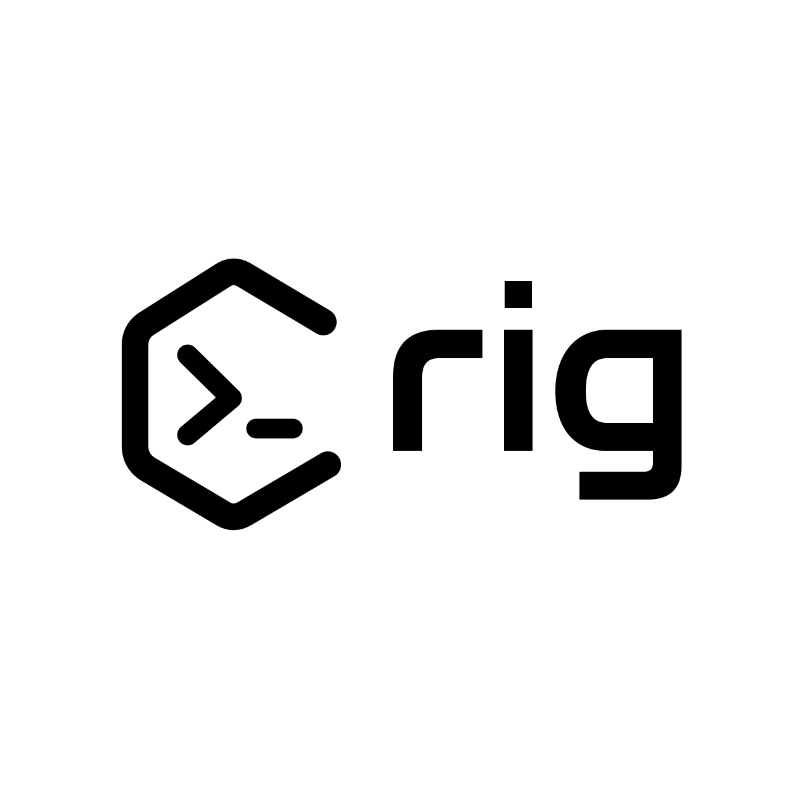

<p align="center">
  
</p>

# Rig

Rig is a local typed command runtime for agents.

It lets users and terminal-based agents create, discover, inspect, and run local TypeScript tools. A tool contains one or more commands. Each command declares input and output schemas, examples, and side effect level.

Command run output always has top-level `data` and `errors`. If `errors` is empty, the command succeeded and `data` is filled. If `errors` is not empty, the command failed.

## Quickstart

```bash
bun install
bun run src/cli.ts
bun run src/cli.ts tool create my-tool
bun run src/cli.ts help my-tool
bun run src/cli.ts run my-tool example test
```

## Model

- Tool: a local TypeScript module, for example `my-tool` or `github`.
- Command: a runnable action inside a tool, for example `example` or `list-prs`.
- Command id: `<tool>.<command>`, for example `my-tool.example`.
- Run syntax: `rig run <tool> <command> [args...]`.
- Args can be positional (`rig run my-tool example test`), key-value pairs (`rig run my-tool example text=test`), or a JSON object (`rig run my-tool example '{"text":"test"}'`).
- Success data path: `data`.
- Error details path: `errors[0]`.
- Success means `errors.length === 0`.

## Config

First run creates:

```txt
~/.rig/rig.json
~/.rig/tools
~/.rig/runtime/sdk.ts
```

Default config:

```json
{
  "version": 1,
  "baseRegistryDir": "~/.rig/tools",
  "customRegistries": []
}
```

## Commands

```bash
rig
rig init
rig doctor
rig config show
rig config path
rig registry list
rig registry add <path>
rig registry remove <path>
rig dev link
rig dev unlink
rig dev status
rig list
rig ls
rig list --plain
rig tool create <tool>
rig help
rig help <tool>
rig help <tool> <command>
rig inspect <tool>
rig inspect <tool> <command>
rig tool inspect <tool>
rig tool inspect <tool> <command>
rig typecheck [tool]
rig run <tool> <command> [args...]
rig run <tool> <command> --dry-run [args...]
rig llm.txt
```

## Run output

A successful command run prints JSON like this:

```json
{
  "data": {
    "text": "test"
  },
  "errors": []
}
```

An error returns `data: null` and a non-empty `errors` array. Use `--dry-run` to validate input and inspect command metadata without executing the command.

Large successful outputs are truncated to 50KB or 2000 lines, whichever comes first. Rig saves the full command data as JSON in a temp file and returns a preview plus metadata in `data`:

```json
{
  "data": {
    "truncated": true,
    "preview": "{\n  \"text\": \"...",
    "previewFormat": "partial-json",
    "fullOutputPath": "/tmp/rig-output-abc123/data.json",
    "fullOutputFormat": "json"
  },
  "errors": []
}
```

## Development

```bash
bun run dev
bun run test
bun run build
```

`bun run test` runs Oxfmt format checks, Oxlint lint checks, and Vitest unit tests.

Rig uses Vitest for unit tests, Oxfmt for formatting, and Oxlint for JavaScript and TypeScript linting. If formatting needs to be written, run `bunx oxfmt .` directly.

For local CLI testing, link this checkout as `rig`:

```bash
bun run src/cli.ts dev link
rig dev status
```

This writes a small shim to `~/.local/bin/rig` that runs `src/cli.ts` with Bun. Remove it with `rig dev unlink`.

## Publishing

The GitHub Actions publish workflow uses npm trusted publishing through OIDC, so it does not need an `NPM_TOKEN` secret. Configure npm package settings with:

- Publisher: GitHub Actions
- Organization or user: `rendotdev`
- Repository: `rig`
- Workflow filename: `publish.yml`
- Allowed action: `npm publish`

Trusted publishing requires npm 11.5.1 or newer and Node 22.14.0 or newer. The workflow uses Node 24 and updates npm before publishing. npm currently requires the package to exist before you can configure trusted publishing, so the first package version uses a short-lived granular `NPM_TOKEN` repository secret. For that token, enable **Bypass two-factor authentication** and grant **Read and write** access in the Packages and scopes section. Organization permissions alone do not grant package publish rights. After the first publish, use trusted publishing and remove publish tokens. Publish a version by pushing a matching tag, for example `v0.0.1`, creating a GitHub Release, or running the workflow manually.

## Tool files

Generated tools create one file by default:

```txt
~/.rig/tools/my-tool/index.rig.ts
```

Examples live inside the tool definition, not in separate README or input files. `rig help <tool>` renders command inputs, outputs, and examples from the definition. `rig inspect` includes full JSON Schema metadata.

Tool modules export a factory. Rig injects the tool runtime so tools do not need to import Rig helpers. Define command schemas with `rig.input(...)` and `rig.output(...)`; Rig brands those schemas and rejects raw Zod schemas so inputs and outputs stay inspectable and policy-ready. Run `rig typecheck [tool]` to type-check tool files with the generated global `RigToolFactory` type. Rig packages TypeScript as a runtime dependency and uses the TypeScript compiler API directly, so users do not need a global `tsc` install.

```ts
const tool: RigToolFactory = (rig) =>
  rig.defineTool({
    name: "my-tool",
    description: "Describe what this tool does.",
    commands: {
      example: rig.command({
        description: "Echo input text.",
        input: rig.input({ text: rig.z.string().default("example") }),
        output: rig.output({ text: rig.z.string() }),
        sideEffects: "read",
        run: async ({ input }) => ({ text: input.text }),
      }),
    },
  });

export default tool;
```

## Limitations

Rig v1 is policy guarded, not a hard sandbox. It validates schemas, produces JSON envelopes, uses safer shell helpers, and blocks declared risky side effects unless allowed. Arbitrary TypeScript still runs locally on the user's machine.
